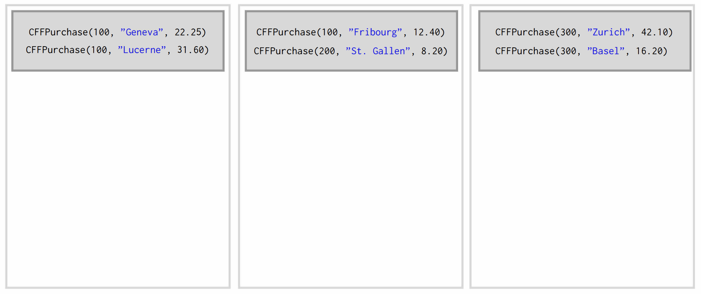
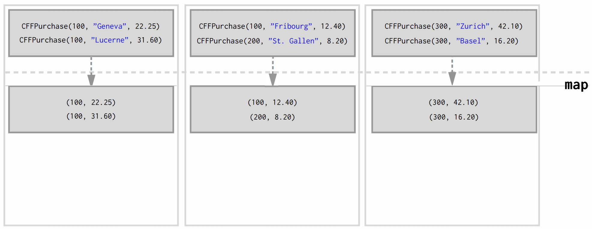
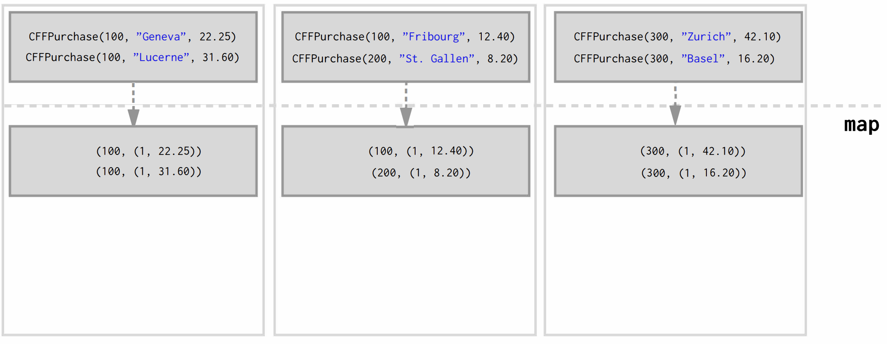

# Shuffling: What it is and why it's important

## 1. Shuffled RDD

### 1.1 Shuffling

groupBy 나 groupByKey를 사용할 때 무슨 일이 일어나는지 생각해보자. (데이터는 여러 노드에 분산되어 있다)

    val pairs = sc.parallelize(List((1, "one"), (2, "two"), (3, "three")))
    pairs.groupByKey()
    // res2: org.apache.spark.rdd.RDD[(Int, Iterable[String])J
    //  = ShuffledRDD[16] at groupByKey at <console>:37 
    
같은 키를 갖는 데이터들이 그룹화되기 위해 노드에서 다른 노드로 이동한다. 이를 <b>Shuffling</b>이라 한다.

Shuffling이 발생하면 대랻의 데이터들이 노드간 이동을 해야하므로 상당한 부하가 따라온다. 
따라서 <b>Latency</b>가 중요하다.

## 2. Grouping and Reducing

### 2.1 Naive Approach with groupByKey

철도회사 고객들의 거래내역을 활용하여 어느 고객이 얼마나 여행을 갔는지, 얼마나 많은 돈을 썼는지
계산하는 Spark 프로그램을 코드로 작성해보자

    case class CFFPurchase(customerid: Int, destination: String, price: Double)
    
    val purchasesRdd : RDD[CFFPurchase] = sc.textFile(...)
    
    val purchasesPerMonth = purchasesRdd
        .map(p => (p.customerid, p.price))          // Pair RDD
        .groupByKey()                               // RDD[(K, Iterable[V])]
        .map(p => (p._1, (p._2.size, p._2.sum)))    // RDD[(K, (Int, Double))]
        .collect()                                  // Array[(Int, (Int, Double))]
    
위와 같이 나이브하게 groupByKey를 사용하여 같은 고객 아이디로 그룹화하면 쉽게 계산할 수 있을 것이다.
다만 위의 코드가 효율적일까?

### 2.2 Latency Matters

위 예제에서 어떤 일들이 일어나는지 구체적으로 살펴보자
    
    val purchases = List(CFFPurchase(100, "Geneva", 22.25),
                         CFFPurchase (300, ''Zurich'', 42. 10),
                         CFFPurchase(100, "Fribourg", 12.40),
                         CFFPurchase (200, ''St. Gallen'', 8. 20),
                         CFFPurchase(100, ''Lucerne'', 31.60),
                         CFFPurchase (300, ''Basel'', 16. 20)) 
                         
위와 같은 데이터가 3개 노드로 이뤄진 클러스터에서 분산 저장되어있다고 가정하자.
이제 이 데이터를 textFile를 사용하여 RDD로 만들 것이다.

여기에 map을 사용하여 (customerid, price)의 키-밸류 쌍의 Pair RDD로 만든다.

Pair RDD에 groupByKey가 적용되면 아래처럼 같은 키를 갖는 데이터가 같은 노드로 이동하는 Shuffle이 발생한다.

각 노드에 존재하는 대다수의 데이터가 키에 따라 네트워크를 이동하게 될 것이다.
이는 당연히 이는 상당한 네트워크 비용을 초래하며 연산 속도는 Shuffle되는 데이터의 양이 많을 수록 기하급수적으로
느려질 것이다.

모든 데이터를 네트워크를 통해 이동시키는 것은 결코 바람직하지 않으며 가급적이면 피해야 한다.
네트워크 이동은 퍼포먼스를 감소시킨다. (Latency Matters)

### 2.3 Optimized with reduceByKey

앞선 예제에서 퍼포먼스를 높이려면 어떻게 해야할까?

핵심은 반드시 <b>모든 데이터를 네트워크로 이동시킬 필요는 없다</b>는 점이다.
Shuffle이 일어나기 전에 reduce를 수행한다면 네트워크로 이동하게 될 데이터의 양은 줄어들 것이다.

여기서 사용할 수 있는 연산이 바로 reduceByKey이다.

    def reduceByKey(func: (V, V) => V): RDD[(K, V)]

reduceByKey를 이용하여 앞의 예제를 최적화해보자

    val purchasesRdd: RDD[CFFPurchaseJ = sc.textFile( ... )
    
    val purchasesPerMonth = purchasesRdd
        .map(p => (p.customerid, (1, p.price)))                     // RDD[(Int, (Int, Double))]
        .reduceByKey((v1, v2) => (v1._1 + v2._1, v1._2 + v2._2))    // RDD[(Int, (Int, Double))]
        .collect()                                                  // Array[(Int, (Int, Double))]
    
최적화된 lineage를 따라 데이터가 어떻게 변하는지 살펴보자.

앞에서와 마찬가지로 map에 의해 Pair RDD가 만들어진다. 
차이점이 있다면 데이터 건수를 세기 위해 1이 튜플 값에 들어간다는 점이다.

이 Pair RDD에 reduceByKey가 적용되면 Shuffle이 일어나기 전에 reduce가 먼저 일어난다.
즉, 같은 노드 안에서 키가 같은 데이터들끼리 먼저 reduce가 수행된다.

reduce의 결과 데이터들에 대해서 Shuffle이 이뤄지며,
네트워크를 통해 이동하게될 데이터의 수가 줄어들었으므로 퍼포먼스가 향상될 것이다.

## 3. Conclusion

키-밸류 쌍 데이터들을 그룹화하면 같은 키를 갖는 모든 데이터는 반드시 한 노드 안에 모이도록 이동해야 한다.
이 때 발생하는 Shuffle의 네트워크 이동은 퍼포먼스를 저하시킨다.

그룹화로 인해 발생하는 Shuffle 비용을 줄이는 최적화 방안의 핵심은 
<b>Shuffle 전에 Reduce를 수행하여 네트워크를 이동할 데이터 양을 줄이는 것</b>이다.

###### Question

Spark은 어느 키를 어느 노드로 이동시킬지 어떻게 결정할까? -> 
Spark은 기본적으로 hash partitioning을 사용하여 각 키-밸류 쌍을 어느 노드로 이동시킬지를 결정한다.
(Partitioning에서 자세히 알아보자!)