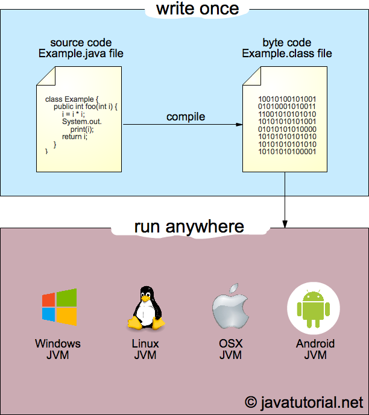

# Java Virtual Machine

JVM, 자바 가상 머신은 자바 어플리케이션을 클래스 로더로 읽어들여 자바 API로 실행시킨다.
JVM은 Java와 OS 사이의 중재자 역할을 하며,  Java가 OS에 상관없이 동작할 수 있도록 해준다.
스택 기반의 가상머신이며, 메모리 관리(Garbage Collection)를 수행한다.

## 자바 프로그램 수행 과정
1. 프로그램이 실행되면 JVM은 OS로부터 메모리를 할당 받는다. JVM은 이 메모리를 용도에 따라 나누어 관리한다.
2. 자바 컴파일러(javac)가 소스코드(.java)를 읽어들여 바이트코드(.class)로 변환시킨다.
3. 바이트코드(.class)는 Class Loader에 의해 JVM으로 로딩된다.
4. 로딩된 바이트코드(.class)는 Execution Engine을 통해 해석된다.
5. 해석된 바이트코드(.class)는 Runtime Data Area에 배치되어 실질적으로 수행된다.

## JIT Compiler
JIT 컴파일(just-in-time compilation) 또는 동적 번역(dynamic translation)은 프로그램을 실제 실행하는 시점에 기계어로 번역하는 컴파일 기법이다.

전통적인 입장에서 컴퓨터 프로그램을 만드는 방법은 두 가지가 있는데, 인터프리트 방식과 정적 컴파일 방식으로 나눌 수 있다. 이 중 인터프리트 방식은 실행 중 프로그래밍 언어를 읽어가면서 해당 기능에 대응하는 기계어 코드를 실행하며, 반면 정적 컴파일은 실행하기 전에 프로그램 코드를 기계어로 번역한다.

JIT 컴파일러는 두 가지의 방식을 혼합한 방식으로 생각할 수 있는데, 실행 시점에서 인터프리트 방식으로 기계어 코드를 생성하면서 그 코드를 캐싱하여, 같은 함수가 여러 번 불릴 때 매번 기계어 코드를 생성하는 것을 방지한다.

최근의 자바 가상 머신과 .NET, V8(node.js)에서는 JIT 컴파일을 지원한다. 즉, 자바 컴파일러가 자바 프로그램 코드를 바이트코드로 변환한 다음, 실제 바이트코드를 실행하는 시점에서 자바 가상 머신이 바이트코드를 JIT 컴파일을 통해 기계어로 변환한다.

## JNI
자바 네이티브 인터페이스(Java Native Interface, JNI)는 자바 가상 머신(JVM)위에서 실행되고 있는 자바코드가 네이티브 응용 프로그램(하드웨어와 운영 체제 플랫폼에 종속된 프로그램들) 그리고 C, C++ 그리고 어샘블리 같은 다른 언어들로 작성된 라이브러리들을 호출하거나 반대로 호출되는 것을 가능하게 하는 프로그래밍 프레임워크이다.

## Reference
- https://asfirstalways.tistory.com/158
- https://javatutorial.net/jvm-explained
- https://ko.wikipedia.org/wiki/JIT_%EC%BB%B4%ED%8C%8C%EC%9D%BC
