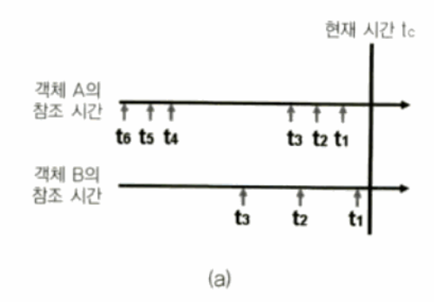

# 페이지 교체 알고리즘 (Page Replacement Algorithm)

페이지 교체 알고리즘은 페이징 기법으로 메모리를 관리하는 운영체제에서, 
Page Fault가 발생 하여 새로운 페이지를 할당하기 위해 현재 할당된 페이지 중 어느 것과 교체할지를 결정하는 방법이다. 
이 알고리즘이 사용되는 시기는 Page Fault가 발생해 새로운 페이지를 적재 해야하나 페이지를 적재할 공간이 없어 
이미 적재되어 있는 페이지 중 교체할 페이지를 정할 때 사용된다. 

단점으로는 TimeStamping에 의한 overhead가 존재한다는 점이다.

## 페이지 교체 알고리즘의 종류
- OPT (Optimal)
- FIFO (First In First Out)
- LRU (Least Recently Used)
- LRU-K (Least Recently Used K-th)
- Clock
- Enhanced Clock
- LFU (Least Frequently Used)
- MFU (Most Frequently Used)

### OPT (Optimal)
앞으로 가장 오랫동안 사용되지 않을 페이지를 교체하는 알고리즘이다.
최적 알고리즘은 수행하기 전에 선행되어야 할 전제조건이 있다. 
프로세스가 앞으로 사용할 페이지를 미리 알아야 한다는 것이다. 
이 전제 조건이 실제 활용에서는 알 방법이 없기 때문에 최적 알고리즘은 구현이 불가능한 알고리즘 이다.

### FIFO (First In First Out)
가장 간단한 알고리즘으로, 메모리에 올라온 지 가장 오래된 페이지를 교체한다. 
이 알고리즘을 수행하기 위해서 각 페이지가 올라온 시간을 페이지에 기록하거나, 
페이지가 올라온 순서를 큐(Queue)에 저장하는 방식 등을 사용할 수 있다.

### LRU (Least Recently Used)
가장 오래 사용되지 않은 페이지를 교체하는 알고리즘이다.
최적 알고리즘은 실제 구현이 불가능하므로, 최적 알고리즘의 방식과 비슷한 효과를 낼 수 있는 방법을 사용한 것이 LRU 알고리즘이다.

- LRU의 단점1: 프로세스가 주기억장치에 접근할 때마다 참조된 페이지에 대한 시간을 기록해야 한다.
즉 계수기나 스택과 같은 별도의 하드웨어가 필요하며, 시간적인 큰 오버헤드가 발생한다.
- LRU의 단점2: 동일한 패턴이 반복되는 경우 성능이 저하된다. 
예를 들어, N개 페이지의 LRU 풀에 대해서 N+1개 페이지의 배열이 반복적으로 참조된다면 매 loop마다 Page Fault가 발생한다.

### LRU-K (Least Recently Used K-th)
LRU는 각 페이지에 대해 가장 최근에 참조된 시간을 기준으로 교체 여부를 정한다.
반면, LRU-K는 각 페이지의 가장 최근 참조 시간이 아니라, 가장 최근에 K번째로 참조된 시간을 기준으로 한다.

예를 들어, 페이지 A와 B에 대해:

- 마지막 참조 시간인 t1 을 비교할 경우, B의 t1이 더 최근과 가까우므로 LRU에선 "A < B" 로 가치평가한다.
- 끝에서 세번쨰 참조 시간인 t3를 비교할 경우, A의 t3가 더 최근과 가까우므로 LRU-3에선 "A > B"로 가치평가한다.

  

### Clock
LRU를 근사화시킨 방식으로, 각 페이지가 최근에 참조되었는지 여부를 활용한다.
1bit짜리 reference bit에 사용했는지 여부를 기록한다.
시간을 일정한 time interval로 나누고, 그 범위 안에서 사용 여부를 비교하는 방식이다.

clock hand가 임의의 페이지를 가리키고 있으며 이 clock hand를 움직여 교체할 페이지를 결정한다.
가리키는 페이지의 reference bit가 1이명 0으로 바꾸고 다음 페이지로 넘어간다.
이 과정을 반복하다가 0인 페이지를 만나면 페이지 교체가 일어난다.

clock hand가 빠르게 돌고 있다면 OS가 과부하 상태일 수 있다.
만약 모든 페이지가 사용 중이라면 clock hand가 전체 페이지를 순회하게 되며,
알고리즘 성능이 FIFO와 동일한 수준으로 떨어지게 된다.

대표적인 LRU 계열의 알고리즘으로, UNIX OS에서 많이 사용하는 방식이다.

### Enhanced Clock
reference bit 뿐만 아니라 dirty bit(페이지 수정 여부 기록)도 고려하여 페이지 교체를 결정하는 방식이다.
reference bit와 dirty bit 모두 1이면 보존하고 둘 다 0이면 우선적으로 교체 대상이 된다.
교체 대상 우선순위는 아래와 같다.

| reference bit | dirty bit | 우선순위 |
| :---: | :---: | :---: |
| 0 | 0 | 교체 1순위 |
| 0 | 1 | 교체 2순위 |
| 1 | 0 | 교체 3순위 |
| 1 | 1 | 교체 4순위 |

여기에도 문제가 남는다. dirty bit가 0인 clean page를 내보내는 것이 반드시 옳은 결정이라고 보장할 수 없다.

매킨토시 OS에서 사용하는 방식이다.

### LFU (Least Recently Used)
참조 횟수가 가장 작은 페이지를 교체하는 알고리즘이다. 
만약 교체 대상인 페이지가 여러 개 일 경우, LRU 알고리즘을 따라 가장 오래 사용되지 않은 페이지로 교체한다.

LFU 알고리즘은 초기에 한 페이지를 집중적으로 참조하다가 이후 다시 참조하지 않는 경우 문제가 될 수 있다. 
앞으로 사용하지 않아도 초기에 사용된 참조횟수가 높아 메모리에 계속 남아있기 때문이다.

### MFU (Most Frequently Used)
LFU 알고리즘과 반대로, 참조 횟수가 가장 많은 페이지를 교체하는 알고리즘이다. 
참조 횟수가 적은 페이지가 최 근에 사용된 것이기 때문에 앞으로 사용될 가능성이 높다는 판단이다.

LFU와 MFU는 실제 사용에 잘 쓰이지 않는다.

 

## Reference
- https://ko.wikipedia.org/wiki/%ED%8E%98%EC%9D%B4%EC%A7%80_%EA%B5%90%EC%B2%B4_%EC%95%8C%EA%B3%A0%EB%A6%AC%EC%A6%98
- https://medium.com/pocs/%ED%8E%98%EC%9D%B4%EC%A7%80-%EA%B5%90%EC%B2%B4-page-replacement-%EC%95%8C%EA%B3%A0%EB%A6%AC%EC%A6%98-650d58ae266b
- https://en.wikipedia.org/wiki/Page_replacement_algorithm#Clock
- http://www.datanet.co.kr/news/articleView.html?idxno=115592
- https://books.google.co.kr/books?id=EcMqBh5MDQIC&pg=PA277&lpg=PA277&dq=LRU-K+%EC%95%8C%EA%B3%A0%EB%A6%AC%EC%A6%98&source=bl&ots=UPpNGusj94&sig=ACfU3U3Nvu3LZIB1wu7mGw9DI47DiQmxuQ&hl=ko&sa=X&ved=2ahUKEwjGl93Py9jpAhUGVN4KHYMXBrsQ6AEwB3oECAcQAQ#v=onepage&q=LRU-K&f=false (도서 "운영 체제와 정보기술의 원리")
- https://jennysgap.tistory.com/entry/%EC%9A%B4%EC%98%81%EC%B2%B4%EC%A0%9C%EC%9D%98-%EA%B8%B0%EC%B4%88-18-Demand-Paging-2
