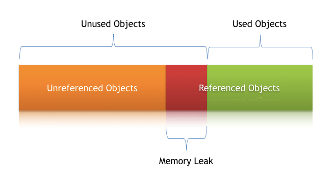

# Understanding Memory Leaks in Java

One of the core benefits of Java is the automated memory management 
with the help of the built-in <b>Garbage Collector</b> (or GC for short). 
The GC implicitly takes care of <b>allocating and freeing up memory</b> 
and thus is capable of handling the majority of the memory leak issues.

The GC doesn't guarantee a foolproof solution to memory leaking. 
Memory leaks can sneak up.


## What Is a Memory Leak
A Memory Leak is a situation when there are objects present in the heap that are no longer used, 
but the <b>garbage collector is unable to remove them</b> from memory and, 
thus they are unnecessarily maintained.

A memory leak is bad because it blocks memory resources and degrades system performance over time. 
And if not dealt with, the application will eventually exhaust its resources, 
finally terminating with a fatal ```java.lang.OutOfMemoryError```.

There are two different types of objects that reside in Heap memory — referenced and unreferenced. 
- <b>referenced objects</b>: those who have still active references within the application
- <b>unreferenced objects</b>: don't have any active references.

The garbage collector removes unreferenced objects periodically, 
but <b>it never collects the objects that are still being referenced</b>. 
This is where memory leaks can occur:




## Symptoms of a Memory Leak
- <b>Severe performance degradation</b> when the application is continuously running for a long time
- <b>OutOfMemoryError</b> heap error in the application
- Spontaneous and strange <b>application crashes</b>
- The application is occasionally <b>running out of connection</b> objects


## JVM Memory Leak 해결하기
- 원인분석: heapdump 분석 (eclipse memory analyzer 등)
- memory 점유율이 높은 object부터 분석 (당연하지만 말처럼 쉽지 않음...)


## 힙 메모리(heap memory)
프로그램을 사용할 수 있는 자유 메모리이다. 
프로그램 실행 시에 함수로 보내는 자료 등을 일시적으로 보관해 두는 소량의 메모리인 '스택'과 필요할 때 언제나 사용할 수 있는 대량의 메모리인 '힙'이 있다. 
바로 이 '힙'이 없어지면 메모리가 부족해서 '이상 종료'하게 된다.


## Reference
- https://www.baeldung.com/java-memory-leaks
- https://www.scienceall.com/%ED%9E%99-%EB%A9%94%EB%AA%A8%EB%A6%ACheap-memory/
- https://woowabros.github.io/tools/2019/05/24/jvm_memory_leak.html
