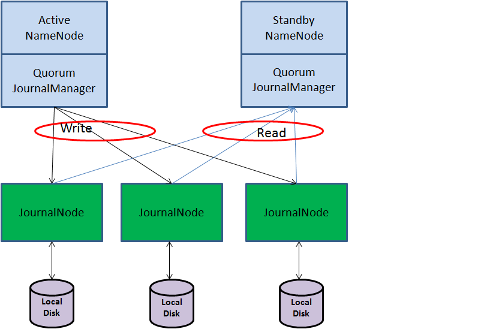

# HDFS HA and Consensus

- 핵심키워드: ```Active-Standby```, ```Zookeeper```, ```JournalNode```, ```QuorumJournalManager```, ```ZKFC```, ```Failover```


## 1. HA(High Availability) 기본

### 1.1. HA를 보장하는 구조

#### 가용성 (Availability)
Hadoop과 같이 다수의 노드로 클러스터를 형성하는 시스템은 서버 수가 많아질 수록 장애 가능성이 높아진다.
장애 상황으로 인해 일부 노드가 정상적으로 동작하지 않더라도 전체적인 처리는 계속될 수 있어야 하는데 이러한 성질을 가용성(Availability)라 한다.

#### 단일 장애 지점 (Single point of failure)
HDFS와 MapReduce의 슬레이브 노드는 다수 존재하여 데이터 블록의 이중화하거나 실패한 task를 재실행하는 것으로 가용성을 보장할 수 있다.
그러나 HDFS의 NameNode와 같은 마스터 노드는 클러스터에 한 대만 존재하여 단일 장애 지점(Single Point of Failure)이 생기게 된다.
따라서 마스터 노드를 어떻게 이중화하는지가 중요하다.

#### HA를 위해 필요한 기능들
HDFS의 NameNode는 파일 시스템 메타데이터를, MapReduce의 JobTracker는 잡 할당과 실행 상태를 각각 보유하고 있다.
그래서 마스터 노드의 가용성을 향상시키려면 다음과 같은 기능이 필요하다.
- 마스터 노드가 가진 정보를 <b>일관성있게 이중화</b>하여 저장하는 기능
- 가동 중인 마스터 노드가 고장나면 스탠바이 노드가 그것을 인식해서 <b>마스터 노드로서 처리를 인계</b>하는 기능
- <b>마스터 노드가 서비스 가능한지를 감시</b>하여 문제가 생기면 머스터 노드를 변경하는 기능

Hadoop 1.x(CDH 3)까지는 Hadoop과 독립된 클러스터링 소프트웨어로 HA를 구성했으나,
Failover 시간이 길다는 문제가 있어서 Hadoop 2.x(CDH 4)부터는 내장 HA 기능이 추가되었다.


### 1.2. Active-Standby 구조와 Failover 처리

#### Active-Standby 구성
평상시 가동 중인 노드는 한 대뿐이며 이 노드에 문제가 생길 경우에 사용할 대기용 노드룰 둔다.

#### Failover 처리
페일오버 처리를 할 때는 액티스 상태의 노드에서 가동 중인 리소스를 정지해야 한다. 구체적으로는 다음의 조치가 필요하다.
- 프로세스 정지
- 파일 시스템 언마운트
- 가상 IP 주소 제거

리소스가 정상적으로 정지 처리 되지 않은 상태에서 스탠바이 노드를 액티브로 전환하면 복수의 노드에서 부정합 처리가 이뤄져 
잘못된 결과를 반환하거나 데이터가 망가질 수 있다.

#### Fencing
이런 상황을 방지하기 위해 액티브 노드를 확실하게 격리하는 처리를 펜싱(Fencing)이라 한다.
프로세스 정지나 파일 시스템 언마운트에 실패할 경우, 서버 관리 모듈을 이용해서 액티브 노드 전원을 끄고 페일오버를 계속하는 것이다.
Hadoop에선 ZKFC(Zookeeper Failover Controller)가 펜싱을 수행한다.


## 2. Zookeeper

Zookeeper는 Hadoop HA 구성에서 노드 감시와 격리제어를 수행한다.
복수의 노드로 구성된 클러스터 구조이다.
작은 크기의 데이터를 저장하기 위해 분산 파일 시스템과 같은 기능을 제공한다.
<b>이중화</b>와 <b>일관성</b>을 둘 다 갖는 구조이다.

### 2.1. leader-follower 구조
Zookeeper는 leader-folower 구조를 갖는다.
클러스터 시작 시, 한 대의 leader를 선출한다. (leader가 다운되면 나머지 노드 중에서 새로운 leader 선출)


* 이미지 출처: https://cwiki.apache.org/confluence/display/ZOOKEEPER/ProjectDescription


### 2.2. Consensus 절차

1. 클라이언트가 특정 follower에게 데이터 갱신을 요청
2. follower는 leader에게 요청을 전송
3. leader는 갱신 처리에 트랜잭션 ID를 부여하고, 모든 노드에게 요청을 전송
4. 각 노드는 갱신 데이터를 저널 로그에 기록하고 leader에게 응답을 반환
5. leader는 과반수 이상의 노드로부터 응답이 돌아온 시점에서 기록 처리가 성공한 것으로 간주하고 클라이언트에게 commit 명령을 반환

핵심은 리더가 트랜잭션 ID를 부여한다는 점이다.
각 노드에서 기록처리는 반드기 트랜잭션 ID 순서로 이뤄져야한다는 제약이 있으므로,
각 노드가 가진 데이터가 일치되는 것을 보장한다.
또한, 전체 처리 속도를 위해 전체의 응답이 아닌 과반수의 응답이 확인된 시점에 기록을 커밋한다.
이러한 이유로 Zookeeper 클러스터는 홀수로 구성된다.


## 3. HDFS HA

### 3.1. DataNode HA
Hadoop은 블록 단위의 replication으로 데이터 가용성을 보장한다.
덕분에 일부 DataNode가 고장나더라도 데이터 처리를 계속할 수 있다.
클라이언트가 HDFS의 파일에 접근할 때 NameNode로부터 블록을 보유한 DataNode 리스트를 받으므로,
DataNode로부터 블록 취득에 실패하더라도 다른 DataNode에 재시도할 수 있다.

즉, 사용자가 DataNode의 가용성 향상을 위해 추가적인 작업을 할 필요가 없다.


### 3.2. NameNode HA
NameNode가 고장날 경우, HDFS의 모든 데이터 처리 CRUD가 불가능해진다. 또한 HDFS에 의존하는 MapReduce 잡도 실행할 수 없게 된다.
때문에 Hadoop 2.x에서는 내장 HA가 제공된다.

NameNode HA에선 standby-NameNode가 가동되며, 블록 리포트는 active-NameNode와 standby-NameNode 양쪽에 전송된다.
이를 통해 Failover 시간을 단축시킬 수 있다.

#### JournalNode
NameNode의 파일 시스템 메타데이터를 이중화하기 위해 JournalNode라는 프로세스가 도입되었다.
```QuorumJournalManager``` 모듈을 통해 NameNode는 JournalNode로 edit logs를 전송한다.

1. NameNode가 파일 시스템 메타데이터를 갱신할 때, 저널 로그를 각 JournalNode에 전송
2. JournalNode는 전송된 edits를 기록하고 NameNode에 응답을 반환
3. NameNode는 과반수의 응답을 받으면 기록 처리가 성공한 것으로 간주한다. (즉, 모든 노드들이 똑같은 edits를 기록 -> consensus)

standby-NameNode는 지속적으로 JournalNode로부터 edits 파일을 취득하여 메모리 상의 파일 시스템 메타데이터를 갱신한다.
또한, 디스크 상의 fsimage 파일을 edits 적용 후의 내용으로 갱신하고, 교체할 checkpoint 처리도 담당한다.
즉, standby-NameNode로 HA를 구성한 경우엔 Secondary NameNode를 사용하지 않는다.




## Reference
- https://hadoopabcd.wordpress.com/2015/02/19/hdfs-cluster-high-availability/
- 도서 "빅데이터 시대의 하둡 완벽 입문", 제이펍, 오오타 카스기 외 다수

그외 읽을거리
- (HDFS Paper) https://storageconference.us/2010/Papers/MSST/Shvachko.pdf
- https://henning.kropponline.de/2016/12/04/sunday-read-distributed-consensus/
- https://www.slideshare.net/iFunFactory/apache-zookeeper-55966566
