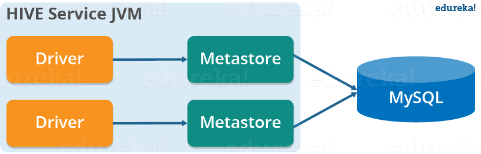
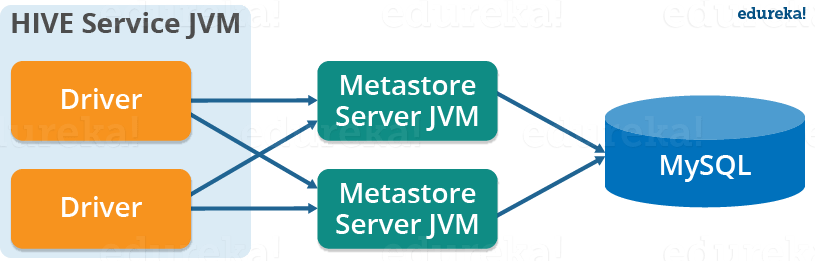

# Top Hadoop Interview Questions 2020 – Apache Hive


## Apache Hive – A Brief Introduction
- a <b>data warehouse</b> system built on top of Hadoop 
- used for <b>analyzing structured and semi-structured</b> data.
- provides a mechanism to project structure onto the data and perform <b>queries written in HiveQL</b> (similar to SQL).
- Internally, these queries or HiveQL gets <b>converted to map reduce jobs</b> by the Hive compiler.


---
### 1. Define the difference between Hive and HBase?
| HBase | Hive |
| :--- | :--- |
| HBase is built on the top of HDFS | It is a data warehousing infrastructure|
| HBase operations run in a real-time on its database rather | Hive queries are executed as MapReduce jobs internally |
| Provides low latency to single rows from huge datasets | Provides high latency for huge datasets |
| Provides random access to data | Provides random access to data |


---
### 3. Where does the data of a Hive table gets stored?
By default, the Hive table is stored in an HDFS directory – ```/user/hive/warehouse```. 
One can change it by specifying the desired directory in ```hive.metastore.warehouse.dir``` configuration parameter 
present in the ```hive-site.xml```. 


---
### 4. What is a metastore in Hive?
Metastore in Hive stores the <b>meta data information using RDBMS</b> 
and an open source ORM (Object Relational Model) layer called Data Nucleus 
which converts the object representation into relational schema and vice versa.


---
### 5. Why Hive does not store metadata information in HDFS?
Hive stores metadata information in the metastore using RDBMS instead of HDFS. 
The reason for choosing RDBMS is <b>to achieve low latency</b> as HDFS read/write operations are time consuming processes.


---
### 6. What is the difference between local and remote metastore?

#### Local Metastore:

In local metastore configuration, the metastore service runs in the same JVM in which the Hive service is running and connects to a database running in a separate JVM, either on the same machine or on a remote machine.



#### Remote Metastore:

In the remote metastore configuration, the metastore service runs on its own separate JVM and not in the Hive service JVM. Other processes communicate with the metastore server using Thrift Network APIs. You can have one or more metastore servers in this case to provide more availability.




## Reference
- https://www.edureka.co/blog/interview-questions/hive-interview-questions/
- https://www.edureka.co/blog/hive-tutorial/
